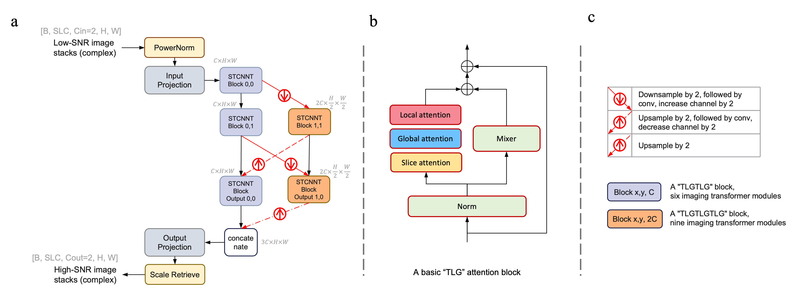

# Advancing accessible low-field MRI with a universal denoising Imaging Transformer (ImT-MRD): Towards fast and high-quality imaging

**Deep learning enabled MRI general denoising at 0.55T (ISMRM 2024, Oral, Magna Cum Laude Award)** [[ISMRM Proceedings](https://submissions.mirasmart.com/ISMRM2024/Itinerary/ConferenceMatrixEventDetail.aspx?ses=O-61)]   
**Advancing accessible low-field MRI with a universal Imaging Transformer denoising network (ImT-MRD): Towards fast and high-quality imaging** [ToBeAnnouced]   
**Imaging transformer** [[Arxiv](https://arxiv.org/abs/2404.02382)]   

Pipeline overview:
 

 
 
Network architecture:
 

 

## Notes
Only inference code is included in this repo.  
Two models were provided: Model-complex and Model-magnitude-preview(under development).  
Matrix size < 400 * 400 is preferable.  

## Command
cd mri

command =  
"python3 run_inference_batch_local.py --input_dir " + \  
&emsp;&emsp;&emsp;&emsp;input_dir + " --output_dir " + \  
&emsp;&emsp;&emsp;&emsp;output_dir + " --power_norm 1600.0 --scaling_factor 1.0 --im_scaling 1.0 --gmap_scaling 1.0 --saved_model_path " + model_path  

if separate_complex:  
&emsp;&emsp;&emsp;&emsp;command += " --separate_complex"  

if save gif or nii:  
&emsp;&emsp;&emsp;&emsp;command += " --save_gif " + str(save_gif)  
&emsp;&emsp;&emsp;&emsp;command += " --save_nii " + str(save_nii)  

### Example
Model-complex:  
python3 run_inference_batch_local.py --input_dir ../examples/ --output_dir ../examples/ --saved_model_path ../pretrained_model_weights/0804-noGmap-l1c1_1e-3_vgg0.1-PN16-03perturb3-NL1to10-noWL-mri-HRNET-conv-parallel-batch2d-sophia-C-32-H-32-MIXER-conv-1-T1L1G1T1L1G1_T1L1G1T1L1G1T1L1G1_T1L1G1T1L1G1T1L1G1_T1L1G1T1L1G1T1L1G1-20231017_031036_complex_residual_20-10-49-20231016_best.pts --separate_complex --save_gif 5 --save_nii 5 --save_input_imgs    
Model-magnitude:  
python3 run_inference_batch_local.py --input_dir ../examples_mag/ --output_dir ../examples_mag/ --saved_model_path ../pretrained_model_weights/0804_image_l1c1_1e-3_vgg0.1-PN16-03perturb3-NL1to10-noWL-mri-HRNET-conv-parallel-batch2d-sophia-C-32-H-32-MIXER-conv-1-T1L1G1T1L1G1_T1L1G1T1L1G1T1L1G1_T1L1G1T1L1G1T1L1G1_T1L1G1T1L1G1T1L1G1-20240416_231332_residual_16-13-46-20240416_best.pts --save_gif 5 --save_input_imgs  

## I/O
### Input directory
folder1(scan1) 
&emsp;-im_real.npy: shape=(x,y,slc), dtype=float  
&emsp;-im_imag.npy: shape=(x,y,slc), dtype=float  
folder2(scan2) 
... 
Notes: if using Model-magnitude, magnitude images will be generated from abs(im_real + 1j*im_imag) throughout pre-processing. Otherwise you can provide magnitude images using im_real = im_magnitude and im_imag = np.zeros_like(im_real).  

### Output directory
folder1(scan1) 
&emsp;-output_real.npy: shape=(x,y,slc), dtype=float, (if separate_complex)  
&emsp;-output_imag.npy: shape=(x,y,slc), dtype=float, (if separate_complex)  
&emsp;-output.npy: shape=(x,y,slc), dtype=complex   
folder2(scan2) 
... 

